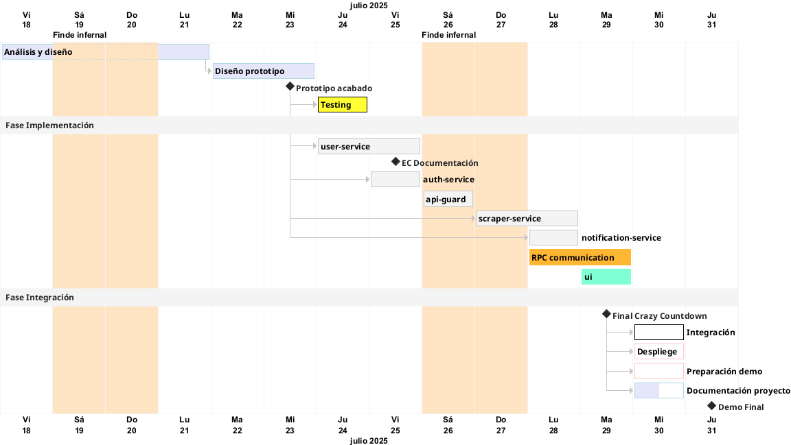

# Planificación

<!--toc:start-->
- [Cronograma](#cronograma)
- [Recursos necesarios](#recursos-necesarios)
- [Requisitos funcionales generales](#requisitos-funcionales-generales)
- [Dependencias generales](#dependencias-generales)
- [Requisitos funcionales: alcance según versiones](#requisitos-funcionales-alcance-según-versiones)
- [Requisitos no funcionales](#requisitos-no-funcionales)
- [Dependencias](#dependencias)
<!--toc:end-->

## Cronograma

## Recursos necesarios

El `MVP` está planteado para desplegarlo solamente en local. Los recursos de personal son muy limitados (1 persona) y los recursos disponibles son un portátil Intel Core i7 con 16GB de RAM.

A priori los microservicios no deberían de consumir muchos recursos ya que no tienen procesos pesados. El proceso más intensivo sin lugar a dudas es responsabilidad del `scraper-service` pero para la Demo del día 31/072025 solamente trabajará contra el localhost y en intervalos fácilmente asequibles.  

A futuro con la versión `0.2.0` nos integraremos con una herramienta externa que hará todo este proceso de manera externa.

## Requisitos funcionales generales

- Login de usuario vía email/pass y SSO:
  - CRUD cuenta de usuario y sus preferencias para las notificaciones.
- Lista de páginas y reglas de usuario.
  - CRUD URLs y reglas de monitoreo.
- Ayuda interactiva del sistema para la creación de reglas.
- Monitoreo recurrente de las páginas.
- Notificación por la vía configurada de los cambios encontrados.

## Dependencias generales

**Microservicios**  

- Spring Security `Security`
- PostgreSQL Driver `SQL`
- Spring Data JPA `SQL`
- H2 Database `SQL` (para desarrollo: base de datos en memoria)
- Spring Web `Web`
- Spring Boot DevTools Developer `Tools` (para desarrollo: reloads, restarts...)
- Validation `I/O`

**UI**  

- TO BE DECIDED

## Requisitos funcionales: alcance según versiones

### `0.1.0`

- **Notificaciones**
  - Email
  - Push
- **Reglas de Monitoreo** (localhost):
  - Toda la página: `bodyHash`
  - Elemento/s concretos (sin ayuda interactiva): `['css-selector']`  
- **Interfaz** simple para acceso de usuarios y gestión de avisos.

### `0.2.0` Requisitos generales

- **Reglas de Monitoreo**:
  - Añadir **ayuda interactiva** para la creación de reglas:
    - Elementos concretos: `['css-selector']`
    - Precio automático
- **Interfaz** con conexión interactiva con el servidor para la validación de reglas.

## Requisitos no funcionales

- El sistema debe operar en todo momento con protocolos seguros:
  - HTTPS para la comunicación con el Front End.
  - RPC entre microservicios.

## Dependencias

### `0.1.0` scraper-service

- Playwright - localhost

### `0.2.0` scraper-service

- Integración con [changedetecion.io](https://github.com/dgtlmoon/changedetection.io)
