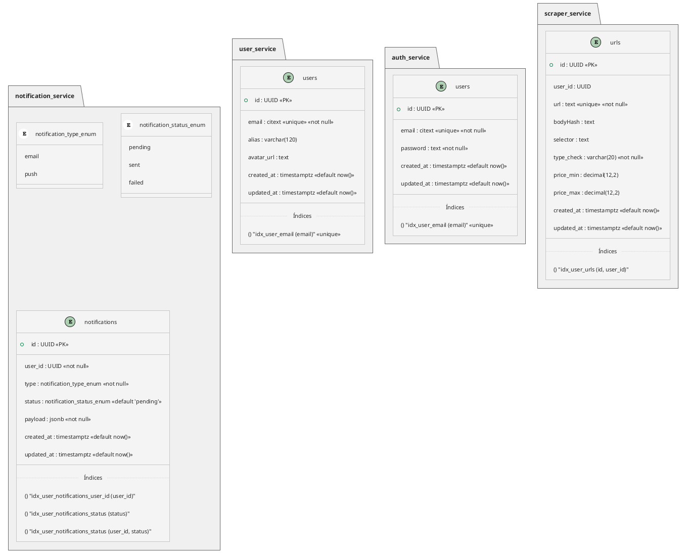

# Análisis/Diseño
<!--toc:start-->
- [Base de datos](#base-de-datos)
- [Componentes principales del Sistema](#componentes-principales-del-sistema)
<!--toc:end-->

## Base de datos

Tras un análisis de las diferentes opciones de gestores de Base de Datos. Me decanto por **PostgreSQL** porque se asemeja mucho a MYSQL pero proporciona funcionalidades extra: colas de mensajes, crons, criptografía …

El concepto principal de los microservicios es que deben de estar tan desacoplados como sea posible, es por esto que cada microservicio tendrá su propia base de datos.

## Componentes principales del Sistema

