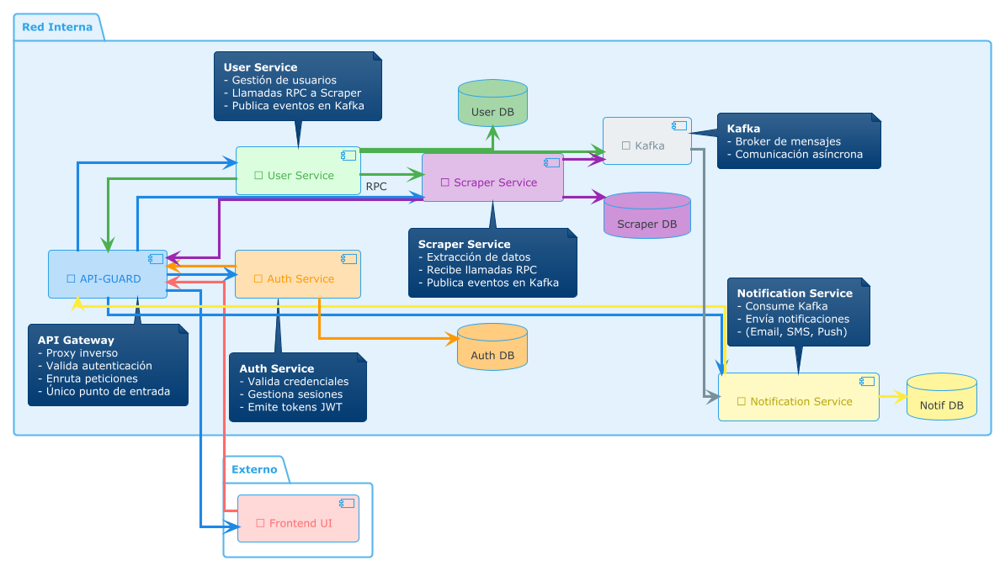

# Análisis/Diseño

<!--toc:start-->

- [Base de datos](#base-de-datos)
- [Componentes principales del Sistema](#componentes-principales-del-sistema)
<!--toc:end-->

> Herramientas que usaremos:
>
> - Diagrama de Clases y flujo: [PLANTUML](https://plantuml.com/) (Integración automática con código)
> - Diagramas de BD: [dbdiagram.io](https://dbdiagram.io/) (exportación de SQL)

## Base de datos

Tras un análisis de las diferentes opciones de gestores de Base de Datos. Me decanto por **PostgreSQL** porque se asemeja mucho a MYSQL pero proporciona funcionalidades extra: colas de mensajes, crons, criptografía …

## Componentes principales del Sistema

La Aplicación tendrá 4 componentes principales:

- #### Scraper

  - Encargado de actualizar el estado de las **URLS** en función de las reglas de monitoreo.
  - Mediante `WebSocket` se encarga de validar con el usuario que las **reglas de monitoreo sean validas** y que el sistema es capaz de procersarlas.

- #### Server

  - Responsable de **autenticar** y manejar correctamente la **sesión del usuario**.
  - Permite a los usuarios modificar sus datos de usuario y hacer un CRUD de URLS exponiendo una **API**.

