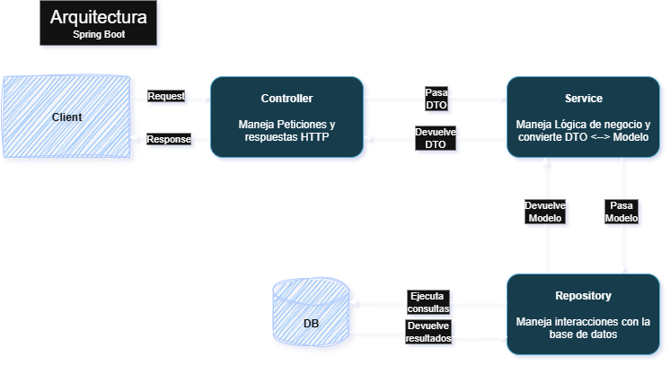
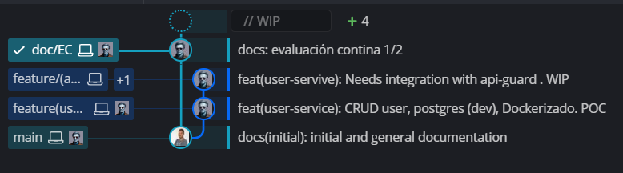

# Implementación

<!--toc:start-->
- [Springboot](#springboot)
  - [Implementación de Microservicios](#implementación-de-microservicios)
- [Estado actual](#estado-actual)
<!--toc:end-->

## Springboot

Vamos a usar la librería de Springboot. La cual nos proporciona una serie de Plugins que nos simplifica enormemente el proceso de desarrollo de nuestros microservicios.

Utilizaremos una arquitectura típica y fiable como la siguiente.  



> La capa de Servicio es la única que conoce tanto al Modelo como al DTO, esto es clave en este diseño.

Los plugins que más vamos a usar son:

**Spring Boot Security**  

- Autenticación/autorización básica.  
- Protege endpoints con config mínima (ej: `@PreAuthorize`).  

**Spring Boot JPA**

- Abstracción de bases de datos (ORM).  
- Elimina boilerplate SQL con repositorios (`CrudRepository`).  

**Spring Boot Testing**

- Pruebas integradas (mock MVC, JUnit, etc.).  
- Anotaciones como `@SpringBootTest` simplifican testing E2E.  

### Implementación de Microservicios

Sirva de ejemplo el componentente `user-service`. La estructura siguiente la seguiremos para todos los componentes del sistema.

```bash
C:\USERS\OSCAR\PAGE-ALERT\USER-SERVICE
|   .gitattributes
|   .gitignore
|   docker-compose.yml
|   Dockerfile
|   pom.xml
\---src
    +---main
    |   +---java
    |   |   \---es
    |   |       \---oscasais
    |   |           \---pa
    |   |               \---userService
    |   |                   |   UserServiceApplication.java
    |   |                   |
    |   |                   +---controller
    |   |                   |       UserController.java
    |   |                   |
    |   |                   +---dto
    |   |                   |       UserRequestDTO.java
    |   |                   |       UserResponseDTO.java
    |   |                   |
    |   |                   +---exception
    |   |                   |       EmailAlreadyExistsException.java
    |   |                   |       GlobalExceptionHandler.java
    |   |                   |       UserNotFoundException.java
    |   |                   |
    |   |                   +---mapper
    |   |                   |       UserMapper.java
    |   |                   |
    |   |                   +---model
    |   |                   |       User.java
    |   |                   |
    |   |                   +---repository
    |   |                   |       UserRepository.java
    |   |                   |
    |   |                   \---service
    |   |                           UserService.java
    |   |
    |   \---resources
    |           data.sql
    |
    \---test
        \---java
            \---es
                \---oscasais
                    \---pa
                        \---userService
                                PageAlertServerApplicationTests.java
```

## Estado actual
>
> [Repositorio Github del proyecto](https://github.com/elsabiina/page-alert)

A fecha 27/07/2025 el desarrollo está en una fase muy incipiente. En realidad, vamos muy atrasados con el planteamiento inicial y quizás tengamos que replantearnos seriamente alguna de las funcionalidades prevista para la versión `0.0.1`.



Actualmente estoy desarrollando el componente `auth-service` y está en un estado bastante avanzado.
